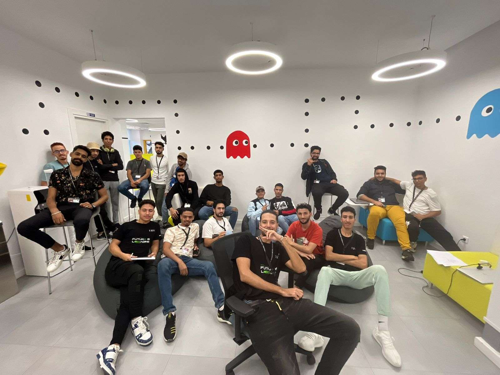

# 1337 Med Pool 2023 – My Experience

Just a brief overview of my *1337 Med Pool experience (2023)*.

### Pool?

**pool:** is a unique experience of 28 days filled with **hard work**, **stress**, and **fun moments** that I believe **everybody should give a try**.  
Whether you pass it or not, I'm sure you’ll walk away knowing **something new about yourself**.

During these intense days, you build more than just technical skills you build **memories, and a good friendships**. 

---

## A Few Words of Advice

A three necessary things that you should know:

### 1. Don't Compare Yourself to Others
Focus on your own progress. Everyone learns at a different pace.  
Aim to improve **your skills** day after day, that's what really matters.

### 2. Respect Your Peers  
Avoid conflicts. Getting into fights can lead to **serious trouble**, including being **kicked out** of the piscine. It might even cost you your second chance.

### 3. Never Cheat
Cheating will get you **blacklisted** from the school — permanently.  
No warnings. No second chances. Just don't do it.

---
## Finaly

I won’t tell you everything about the piscine — and that’s on purpose.

Because part of what makes the piscine so special is **discovering it for yourself**. The surprises, the challenges, the late nights, the breakthroughs. they all hit differently when you experience them firsthand.

So go in with an open mind, a strong heart, and a willingness to learn.  

---
## 📊 My Progress

| Project              | Score |
|----------------------|-------|
| [C Piscine C 00](https://github.com/AchrafMez/1337-piscine/tree/main/C00)         | 85    |
| [C Piscine C 01](https://github.com/AchrafMez/1337-piscine/tree/main/C01)         | 65    |
| [C Piscine C 02](https://github.com/AchrafMez/1337-piscine/tree/main/C02)         | 55    |
| [C Piscine C 03](https://github.com/AchrafMez/1337-piscine/tree/main/C03)         | 87    |
| [C Piscine C 04](https://github.com/AchrafMez/1337-piscine/tree/main/C04)         | 70    |
| [C Piscine C 05](https://github.com/AchrafMez/1337-piscine/tree/main/C05)         | 55    |
| [C Piscine C 06](https://github.com/AchrafMez/1337-piscine/tree/main/C06)         | 70    |
| [C Piscine C 07](https://github.com/AchrafMez/1337-piscine/tree/main/C07)         | 0     |
| [C Piscine Exam 00](https://github.com/AchrafMez/1337-piscine/tree/main/EXAM00)   | 40    |
| [C Piscine Exam 01](https://github.com/AchrafMez/1337-piscine/tree/main/EXAM01)   | 30    |
| [C Piscine Exam 02](https://github.com/AchrafMez/1337-piscine/tree/main/EXAM02)   | 20    |
| [C Piscine Final Exam](https://github.com/AchrafMez/1337-piscine/tree/main/EXAM03) | 48   |
| [C Piscine Shell 00](https://github.com/AchrafMez/1337-piscine/tree/main/shell00) | 100   |
| [C Piscine Shell 01](https://github.com/AchrafMez/1337-piscine/tree/main/shell01) | 70    |
